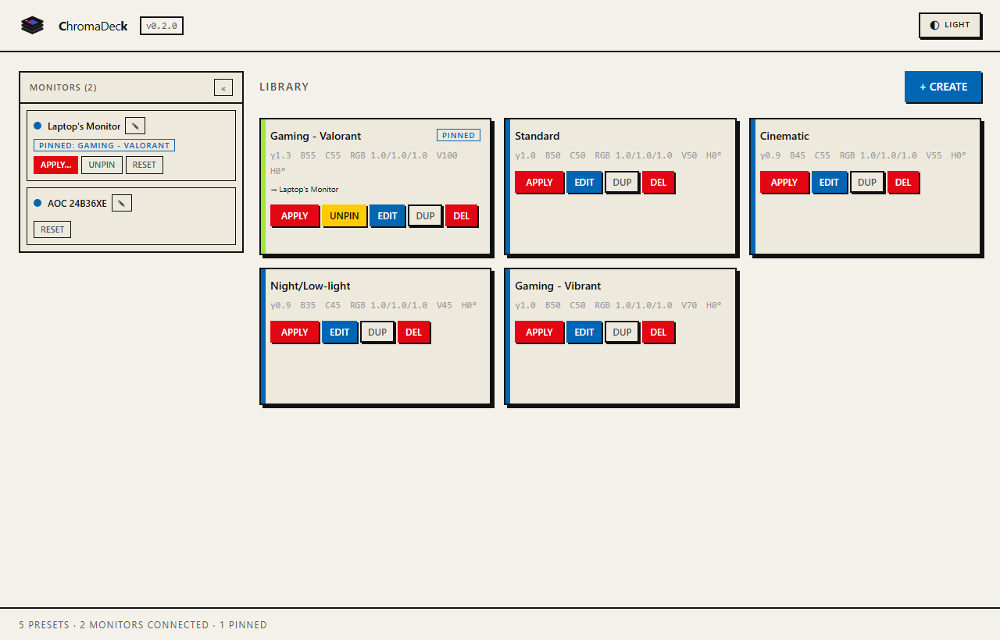

# ChromaDeck

Per-monitor display color profile manager for Windows. Save color presets per monitor — brightness, contrast, gamma, RGB gains, digital vibrance, hue, and ICC profiles — and apply, pin, or enforce them from a single deck-style UI.



## Features

- **Global presets, per-monitor pins** — presets are monitor-agnostic and apply to any display (identified by EDID, stable across docking, reconnects, and reboots); pin one preset per monitor for enforcement. Monitors are user-renamable.
- **NVCP-native color engine** — brightness/contrast/gamma use NVIDIA's own transfer math, driver API, and registry persistence, so results match the NVIDIA Control Panel exactly. Automatic GDI fallback on non-NVIDIA displays.
- **Digital vibrance & hue** — driven through the NVIDIA driver (same control as NVCP), with per-display support detection.
- **ICC profiles** — bundle `.icc`/`.icm` files into presets and associate them per monitor.
- **Pin & enforce** — pin a preset per monitor and a background loop restores it if anything (games, HDR toggles, driver updates) stomps it. Tray-resident with autostart and single-instance.
- **Reset, duplicate, delete** — full-default reset (gamma + vibrance + hue), one-click duplicate, delete with confirmation.
- **Import NVCP state** — capture the driver's live color state straight into a new preset.
- **Preset deck UI** — Bauhaus design system with light/dark toggle, theme-aware logo, shape-coded controls, tap-to-apply deck, in-use highlighting on preset cards, monitor sidebar, support for offline monitors.

## Installation (Windows 10/11 x64)

Download from the [releases page](https://github.com/miiidev/ChromaDeck/releases) or build it yourself:

| File | What it is |
|---|---|
| `ChromaDeck_*_x64_en-US.msi` | Standard Windows installer (recommended) |
| `ChromaDeck_*_x64-setup.exe` | NSIS setup wizard |
| `chromadeck.exe` | Standalone binary, no install needed |

Requirements: Windows 10/11 x64 and the WebView2 runtime (preinstalled on Windows 10 1809+ and Windows 11). An NVIDIA GPU unlocks digital vibrance/hue and the NVCP-native engine; other GPUs fall back to OS-level color controls where supported.

## Usage

1. Launch ChromaDeck — your connected monitors appear in the sidebar; presets live in the library deck.
2. Select a monitor, then **+ Create** (or the big button in the empty state) to build a preset: name it, tweak sliders, optionally attach an ICC profile or import the live NVCP state.
3. Click a preset pad (or **Apply**) to set it on that monitor.
4. **Pin** a preset to keep it enforced; **Reset** returns the monitor to full defaults; rename any monitor with the ✎ button.

All values show their neutral points in the editor (e.g. brightness/contrast 50, gamma 1.0): a fresh preset changes nothing until you move a slider.

## How it works

- **Frontend:** React + Vite + Tailwind CSS v4, Bauhaus design system (light/dark themes, see `DESIGN.md`).
- **Backend:** Rust via Tauri v2. `monitor.rs` enumerates displays as an adapter→monitor tree with EDID identity; `store.rs` persists presets/pins/aliases as JSON; `color.rs` applies ICC + gamma ramps; `nvgamma.rs` + `nvapi.rs` implement the NVCP transfer math (reimplemented from observed driver behavior), 1024-entry float ramps, and driver-registry persistence; `enforce.rs` runs the 10-second drift-check loop.
- **Data lives in** `%APPDATA%\ChromaDeck\` (`presets.json`, `pins.json`, `monitor_names.json`, `profiles\`, plus timestamped `.bak-*` backups before migrations).

## Development

Prerequisites: Node.js 20+, Rust stable toolchain.

```powershell
npm install          # frontend deps
npm run tauri dev    # dev app with hot-reload
```

Verification (all must pass):

```powershell
npx tsc --noEmit     # typecheck (repo root)
npx vitest run       # frontend tests (repo root)
cargo test           # backend tests (src-tauri/)
npm run tauri build  # release bundles -> src-tauri/target/release/bundle/
```

Project layout:

```
src/                    # React frontend (App, components, lib)
src-tauri/src/          # Rust backend (monitor, store, color, nvapi, nvgamma, enforce)
docs/superpowers/       # design specs + implementation plans
docs/screenshots/       # README images
samples/                # sample ICC profile for testing
```

## Acknowledgements

- [nvBrightness](https://github.com/pbatard/nvBrightness) by Pete Batard — behavioral reference for NVIDIA's brightness transfer math (reimplemented, no code reused).
- [NvAPIWrapper](https://github.com/falahati/NvAPIWrapper) — reference for NVAPI interface IDs.
- Built with [Tauri](https://tauri.app/), React, and Tailwind CSS.

## License

MIT — see [LICENSE](LICENSE). (Default choice; say the word if you'd rather ship another license.)
